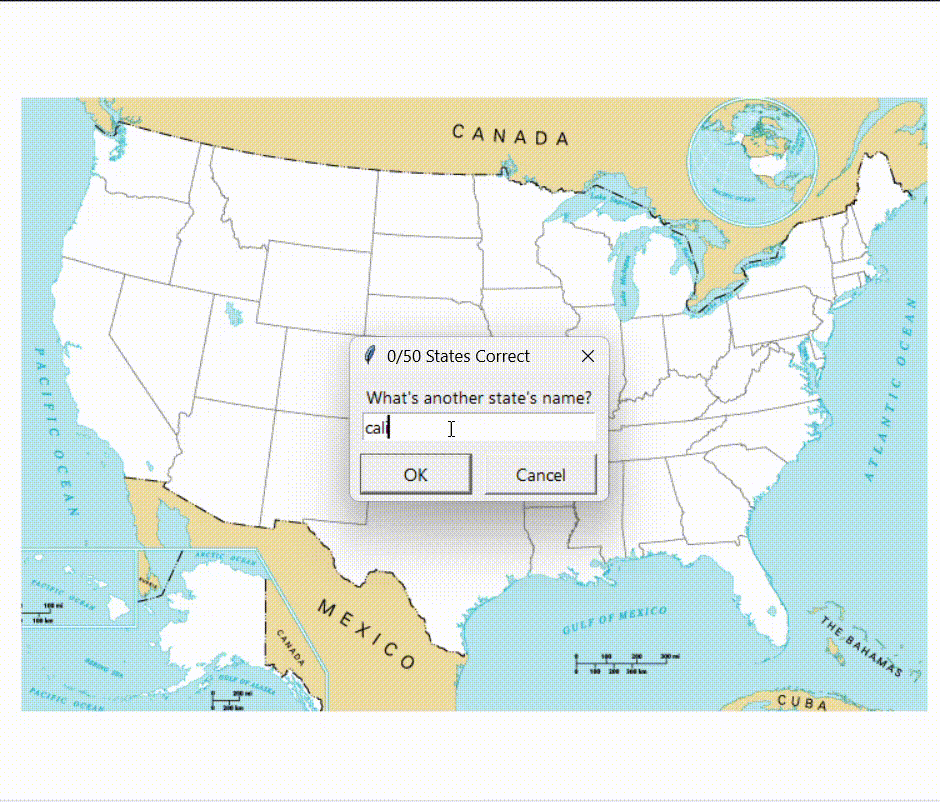
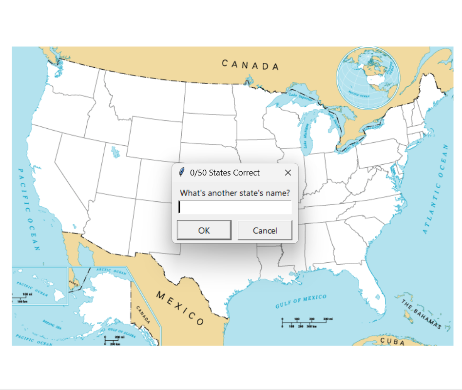

# U.S. States Guessing Game

This project is a fun and interactive game built using Python's `turtle` graphics module and the `pandas` library. It challenges the player to name all 50 U.S. states. When a correct guess is made, the state's name appears on a map of the United States. At the end, states the user missed are saved to a CSV file for future practice.

---

## 🐍 Built With

- **Python**: Core language used.
- **turtle module**: For GUI, drawing the map, and showing guessed states.
- **pandas library**: For reading CSV data and managing guessed/missed states.

---

## 🎮 Gameplay

- A blank map of the United States appears.
- The user is prompted to guess a state name.
- Correct guesses are shown at the appropriate position on the map.
- The game ends when all states are guessed or the user exits.
- A CSV file `states_to_learn.csv` is generated with the names of missed states.

---

## 🗂️ Project Structure

```
├── main.py                 # Game logic
├── 50_states.csv           # State names with x/y coordinates
├── blank_states_img.gif    # Blank U.S. map used in the game
├── us_states.gif           # Gameplay or colored map image
├── screenshot.png          # Optional screenshot of game
├── states_to_learn.csv     # Output file of missed states
```

---

## 🖼️ Screenshots

### 🗺️ Gameplay




### 📍 Game Start


---

## 🚀 How to Run

1. Make sure you have Python installed.
2. Install pandas if not already installed:

```bash
pip install pandas
```

3. Run the game:

```bash
python main.py
```

---

## 📄 Output

At the end of the game, a file `states_to_learn.csv` is created. It includes all the states the player missed, allowing for self-practice later.

---

## 📌 Notes

- The map and coordinates were extracted from `50_states.csv`.
- Turtle graphics window will appear for the gameplay.

---

## 🙌 Contributions

Feel free to fork this repository and improve the game or customize it for other countries and quizzes.

---


## 👨‍💻 Author

**Saurabh Kulshrestha**  
Passionate Python & Web Developer | CSE Student  

---